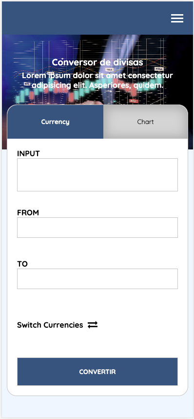
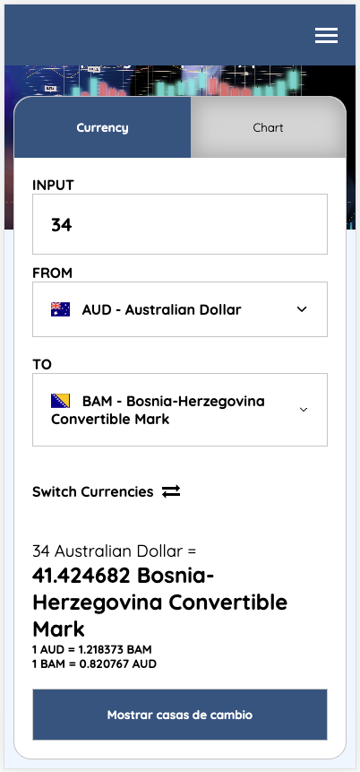
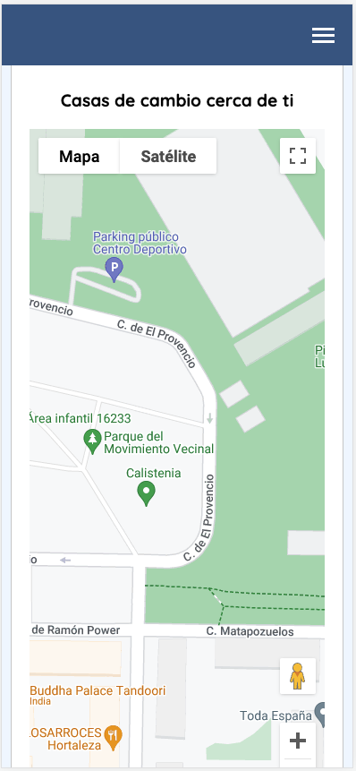
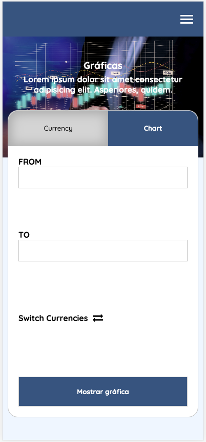
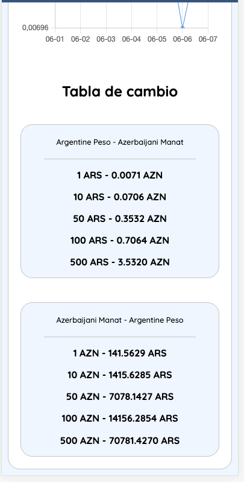
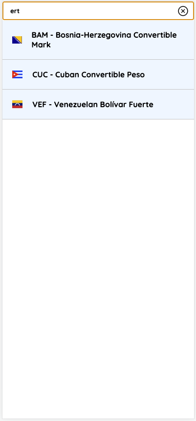

# SPA Cambio de divisas

## Contenidos

- [Overview](#overview)
  - [Objetivos](#funcionamiento)
  - [Capturas de pantalla](#screenshots)
  - [Links](#links)
- [Proceso](#proceso)
  - [Herramientas utilizadas](#herramientas)

## Overview

SPA

### Funcionamiento

Esta SPA consta de tres funcionalidades:

- Comprobar el cambio actual de cualquier divisa de curso legal.
- Comprobar la evolución de una moneda en concreto a lo largo del tiempo
- Consultar cuales son las casas de cambio más cercanas a su ubicación actual

### Screenshots

### Links

- Repositorio: [Link](https://github.com/aerozfx/frontend-project)
- Demo: [Link](https://aerozfx.github.io/frontend-project/)

## Herramientas

- HTML5 semántico
- CSS3
- ES6
- Orientado a mobile-first
- APIs - [Google Maps](https://developers.google.com/maps?hl=es-419) y [Fixer.io](https://fixer.io/)
